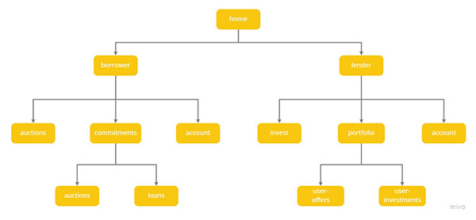

# Table of contents

#### 1. [About Application](#About)

#### 2. [Usage](#Usage)

#### 2.1 [Users](#Users)

#### 2.2 [Loan Creation](#Loan-Creation)

#### 2.3 [Offer Selection](#Offer-Selection)

#### 2.4 [Banking API/Payments](#Banking-API/Payments)

#### 3. [Live Demo](#Live-Demo)

#### 4.

# 1 About

Application was created as part of **[FintechChallange](https://www.fintechchallenge.pl/)** organized by **[HL Tech](https://www.facebook.com/HLTechCentre/)** company and was based on the predefined environment.
The main idea was to create a "social-lending" platform, which would connect two types of users: lender and borrower. It would allow granting loans to natural persons without the participation of a bank.

# 2 Usage

On the home page the user is choosing, if he wants to enter the application as a lender or borrower. At the moment after this choice the user goes to the borrower/lender account, but in the future there will be a registration/login feature added in this place. Thanks to this division application is clear and more intuitive for the user.

### 2.1 Users

##### Borrower

As a borrower user has access to the following functionalities:

-   All Auctions - Browsing the list of all auctions with offers added to them
-   My Auctions - Creating new auctions and editing existing ones
-   My Loans - Managing created loans, inlc. repayment of the loan installment, confirmation of creation the predefined loan (see [Loan Creation](#loan-creation))
-   My Account - User data preview and account managing on the platform, incl.  
    making deposits and withdrawals to the account (see [Banking API](#banking-api))

##### Lender

As a lender user has access to the following functionalities:

-   Investments - Browsing the list of all auctions with offers added to them, possibility to make an offer to the selected auction
-   My offers - Browsing offers created by users to the auctions and possibility to remove active offers (only for the auctions that are still open and were not converted to loan yet)
-   My Investments - Browsing user's investments. After folding out the investment user can see the schedule of certain loan installments with visual indication of paid ones. There is also a link to the public borrower's profile, where he can check basic information about the borrower, his ranking and comments added by other lenders. Users can also add a comment and rate the borrower (see [Ranking](#ranking)).
-   My Account - User data preview and account managing on the platform, incl. making deposits and withdrawals to the account (see [Banking API](#banking-api))

### 2.2 Loan Creation

Process of creating a loan/investments is illustrated by diagram below:

Borrower creates an auction. For the auctions with `ACTIVE` or `ACTIVE COMPLETE` status, the lender may submit his offer. The amount of the bid cannot exceed the amount defined in the auction.
When the sum of the bids is equal to, or greater than the defined amount in the auction, the auction status changes to `ACTIVE COMPLETE`. Bids can still be submitted to this auction, but the borrower can close the auction by creating an initial loan with the status `UNCONFIRMED`. The best offers are automatically selected at this point (see [ Offer Selection](#offer-selection)).
Borrowers can find this loan in the `My Loans` tab and lenders can see it in `My Investments` tab. After the loan is approved, it becomes `ACTIVE`. Both in investments and loans, there appears a repayment schedule for loan installments. By clicking the `Pay Repayment` button, the borrower repays the last unpaid installment (see [Banking API](#banking-api)).
After the loan is fully repaid, it changes its status to `PAID`, and the investments of the lender changes its status to `COMPLETED`.

### 2.3 Offer Selection

Offers submitted by lenders are automatically selected in the process of creating a loan. First, offers with the most favorable rating (the lowest one) are being selected. If the offer's sum is higher than the final loan, the amount of the last offer is being divided.
The loan rate is calculated based on the average rate of all selected offers. The rate of the offers does not change, only the amount of the offer may be reduced when the loan is created. The rate determined when creating the auction is only the borrower's "wish" installment and is not taken into account when creating a loan - it is only intended to inform lenders about the rate proposed by the borrower.

### 2.4 Banking API/Payments

Payments on the platform are simulated with the help of Banking API which was prepared by HL Tech company.
Each user has two accounts - private one and platform one. From the level of the application he can transfer amounts from one account to another. The platform account is used for settlements between users.
When a user is repaying his loan installment, the amount is automatically divided between lenders and transferred to their account. Borrower does not need to worry about dividing the amount and making separate transfers.

### 2.5 Statuses used in application

##### Auctions

-    `ACTIVE`
-    `ACTIVE COMPLETED`
-    `ARCHIVED`

##### Offers

-    `ACTIVE`
-    `ARCHIVED`

##### Loans

-    `UNCONFIRMED`
-    `ACTIVE`
-    `REPAID`

##### Investments

-    `UNCONFIRMED`
-    `ACTIVE`
-    `COMPLETED`

##### Payments

-    `PAID`
-    `EXPECTED`

# 3 Live Demo

Application is available here: (username: example, password: example)
SIT - https://social-lending.kale-team.sit.fintechchallenge.pl/
UAT - https://social-lending.kale-team.uat.fintechchallenge.pl/
PROD - https://social-lending.kale-team.fintechchallenge.pl/

# 4 Project Details

### 4.1 Setup

#### Launching application

This project was bootstrapped with [Create React App](https://github.com/facebook/create-react-app).

#### Available Scripts

In the project directory, you can run:

###### `npm start` or `yarn start`

It runs the app in the development mode.\
Open [http://localhost:3000](http://localhost:3000) to view it in the browser. The page will reload if you make edits.\
You will also see any lint errors in the console.

###### `npm test` or `yarn test`

Launches the test runner in the interactive watch mode.\
See the section about [running tests](https://facebook.github.io/create-react-app/docs/running-tests) for more information.

###### `npm run build` or `yarn run build`

Builds the app for production to the `build` folder.\
It correctly bundles React in production mode and optimizes the build for the best performance. The build is minified and the filenames include the hashes. The application is ready to be deployed.
See the section about [deployment](https://facebook.github.io/create-react-app/docs/deployment) for more information.

###### `npm run eject` or `yarn run eject`

**Note: this is a one-way operation. Once you `eject`, you can’t go back!**
If you aren’t satisfied with the build tool and configuration choices, you can `eject` at any time. This command will remove the single build dependency from your project.
Instead, it will copy all the configuration files and the transitive dependencies (webpack, Babel, ESLint, etc) right into your project so you have full control over them. All of the commands except `eject` will still work, but they will point to the copied scripts so you can tweak them. At this point you’re on your own.
You don’t have to ever use `eject`. The curated feature set is suitable for small and middle deployments, and you shouldn’t feel obligated to use this feature. However we understand that this tool wouldn’t be useful if you couldn’t customize it when you are ready for it.

### 4.2 Folders Structure

Files in the repository are ordered in the following folders:

-   src/
-   api/ - API requests, typing of API requests (suffix Form) and responses (suffix Dto)
-   components/
-   pages/ - pages views
-   shared/ - single components
-   helpers/ - helpers files used across whole application, such as ROUTES, defined colors, API paths
-   hooks/ - used hooks
-   test/ - tests folder was divides in two main part, depending on functionalities (integration tests and unit tests), both of them has the same folder structure as in application src/ folder
    &nbsp;&nbsp;&nbsp;&nbsp;&nbsp;&nbsp; - integration
    &nbsp;&nbsp;&nbsp;&nbsp;&nbsp;&nbsp; - unit
    &nbsp;&nbsp;&nbsp;&nbsp;&nbsp;&nbsp; - helpers - folder with additional files

### 4.3 Routing

The diagram below is presenting routing schema:

### 4.4 Dependencies

-   axios: 0.19.0
-   emotion: 10.0.0
-   formik: 2.2.1
-   react: 17.0.1
-   react-router-dom: 5.2.0
-   typescript: 3.8.3

All dependencies are listed in package.json file.

### 4.5 API

All requests are sent to API using axios library and defined hooks.
Implementation details of API and database can be found [under this link](https://bitbucket.fintechchallenge.pl/projects/KALE/repos/solidlendingplatform/browse).
Check [here](https://solid-lendig-platform.kale-team.sit.fintechchallenge.pl/swagger-ui/#/account-controller/depositAmountInPlatformUsingPOST) for requests details.

#### Banking API

Requests to bank API are passed through Server API. For more information, check [here](https://hltechbank.thebe-team.sit.fintechchallenge.pl/swagger-ui/index.html?configUrl=/hltech-bank/api-docs/swagger-config#/Transactions/createWithdrawal)

### 4.6 Tests

Application was tested with [React Testing Library](https://github.com/testing-library/react-testing-library) and [JEST](https://jestjs.io/). The tests are added to the test/ folder. The command to run tests is `npm test` or `yarn test`. Additionally application was tested with e2e tests, [link to e2e tests repository](https://bitbucket.fintechchallenge.pl/projects/KALE/repos/solidlendingplatform_e2etests/browse).

### 4.7 Styles

Many application components are based on [Material UI library](https://material-ui.com/).
Also use [emotion](https://emotion.sh/docs/introduction) library for styling.
File resetStyles.ts in src/ folder is resetting global application styles.
Check src/helpers/constants-colors.ts for global color variables.
